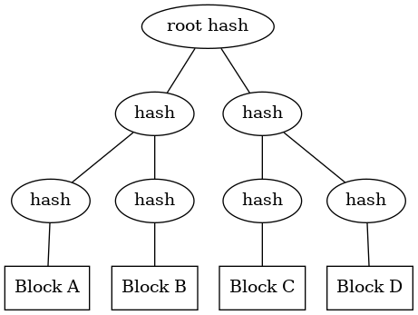

# Golang Merkle Tree
`main.go` showcases a simplistic implementation of a [Merkle tree](https://en.wikipedia.org/wiki/Merkle_tree).
Stuff that should be added to make it useful for actual application:

* Keeping hashes instead of recalculating them every time
  (since currently it defeats the purpose of a Merkle tree by recalculating the hash each time it's used).
* Helper functions for comparing trees to find our which blocks are missing/incorrect.

## Overview
A Merkle tree is a binary tree where each node is a hash of the its children.
These children themselves are hashes of their children, until the leaf nodes are reached
which are hashes of the actual data blocks being hashed.

So to construct a Merkle tree you have to hash each data block, pair them in order, concatenate the hashes of
each pair which forms the first nodes. This continues until one hash remains a.k.a. the root hash.

Effectively you'd be doing this:

`root = hash(hash(hash(a) + hash(b)), hash(hash(c) + hash(d)))` 

Should there be an odd number of nodes at a certain depth, this implementation assumes a empty (zeroed) hash for the missing block (20 zeroed bytes since SHA-128 is used).